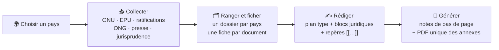

<p align="center"></p>

<h1 align="center">Probasile</h1>

<p align="center"><b>Personne n'est illégal·e. Papiers pour toustes ou pour personne.</b><br>
<i>Preuves et rédaction pour le droit des étrangers en Belgique.</i></p>

<p align="center">


</p>

<p align="center">
<a href="#-installation">Installation</a> ·
<a href="#-ce-que-fait-probasile">Fonctionnalités</a> ·
<a href="#-premiers-pas">Premiers pas</a> ·
<a href="#-questions-fréquentes">FAQ</a> ·
<a href="#-contribuer">Contribuer</a> ·
<a href="README_nl.md">🇧🇪 Nederlands</a> ·
<a href="README_de.md">🇧🇪 Deutsch</a>
</p>

---

## ✊ Pourquoi Probasile

Dans une demande de protection internationale, un recours contre un ordre de quitter le territoire ou une demande 9ter, **c'est à la personne de prouver le risque qu'elle court**. Pour y parvenir, il faut :

- retrouver les observations des comités de l'ONU, les rapports des ONG, les ratifications et la jurisprudence ;
- vérifier les dates et les cotes ;
- rédiger des notes de bas de page propres ;
- numéroter et assembler des dizaines d'annexes.

Tout cela prend des heures, et ces heures manquent pour écouter les personnes et construire leur dossier.

**Probasile fait ce travail répétitif à votre place.** Il va chercher les sources, les range, les cite correctement et assemble le dossier d'annexes, pour que le temps reste consacré à ce qui compte : l'histoire de la personne et l'argumentation.

C'est un **logiciel libre et gratuit**, pensé par et pour le terrain :

- les avocat·es et juristes en droit des étrangers ;
- les services juridiques d'associations ;
- les permanences, les cliniques juridiques et les étudiant·es.

> 🔒 **Tout reste sur votre ordinateur.** Probasile n'a ni serveur ni compte, et ne collecte aucune donnée. Les documents de vos client·es ne quittent jamais votre machine.

---

## 🧭 En un coup d'œil



---

## 📸 Captures d'écran

<p align="center"></p>
<p align="center"><i>Le texte généré : les repères sont devenus des notes de bas de page, avec « Ibid. », la traduction libre et le renvoi « voir l'annexe n° X ».</i></p>

<table>
<tr>
<td width="50%"><br><sub><b>Collecter</b> : comités de l'ONU, état des rapports, EPU, ratifications.</sub></td>
<td width="50%"><br><sub><b>Rédiger</b> : plan type, blocs juridiques et repères du pays.</sub></td>
</tr>
<tr>
<td><br><sub><b>Repères</b> : chaque source prête à citer ; on choisit ce qui est annexé.</sub></td>
<td><br><sub><b>Paragraphes calculés</b> : ratifications, retards, plaintes, écrits à partir de la collecte.</sub></td>
</tr>
<tr>
<td><br><sub><b>Jurisprudence</b> : Cour eur. D.H., C.J.U.E., Cour constitutionnelle, import par référence.</sub></td>
<td><br><sub><b>Annexes</b> : un seul PDF, page de garde et tampon « Annexe n° 1 – p. 1/15 ».</sub></td>
</tr>
</table>

<sub>Exemple fictif (« Monsieur A. Exemple ») ; les documents de l'ONU sont publics.</sub>

---

## 🔧 Ce que fait Probasile

### 1. Collecter les sources d'un pays

| Onglet | Ce qui est rassemblé |
|---|---|
| **ONU** | <ul><li>**Organes de traités** (CCPR, CAT, CESCR, CEDAW, CRC, CERD, CED, CRPD, CMW) : observations finales, listes de points, rapports de l'État, courriers de suivi. Les documents sont retrouvés par leur cote (par ex. `CCPR/C/IDN/CO/2`), en français quand la version existe.</li><li>**État des rapports** : dates dues et dates de remise, utiles pour montrer les retards de l'État.</li><li>**Examen périodique universel** : rapport national, compilation de l'ONU, résumé des parties prenantes, recommandations, et celles que l'État a acceptées ou seulement « notées ».</li><li>**Ratifications** : dates de signature et de ratification, texte des réserves et déclarations, objections des autres États, procédures de plaintes individuelles acceptées ou non.</li></ul> |
| **Rapports (ReliefWeb)** | Rapports du HCDH, du HCR, de l'OMS, de l'UNICEF, de Human Rights Watch, d'Amnesty International, de Crisis Group, de la FIDH, de l'OMCT, de l'EUAA, du Département d'État… On filtre par thème, période, langue et mots-clés. Deux préréglages sont prévus : **Droits humains (PI, OQT)** et **Santé (9ter)**. |
| **Presse et veille** | Flux RSS et recherches Google Actualités, par exemple sur des sites de presse ou d'ONG nationales, dans la langue du pays. Les listes sont mémorisées pour chaque pays. |
| **Jurisprudence** | <ul><li>**Recherche automatique** : Cour eur. D.H. (HUDOC), C.J.U.E. et Cour constitutionnelle, filtrées par article (par ex. « 3 CEDH, 33 Genève »).</li><li>**Import par référence** : C.E., C.C.E., Cour de cassation (ECLI) et comités de l'ONU (par ex. `CAT/C/66/D/832/2017`).</li><li>Chaque décision reçoit une **citation déjà mise en forme**.</li></ul> |
| **Importer** | Tout document trouvé à la main, sous forme de fichier ou de lien. Les communications des procédures spéciales (`AL`, `UA`, `OL`) sont reconnues automatiquement. |

Pour les collectes suivantes, l'option **« Nouveautés seulement »** ne va chercher que ce qui a été publié depuis la dernière fois, et le **journal** en dresse la liste.

### 2. Ranger et ficher

Chaque document est rangé par catégorie dans le dossier du pays :

```
Probasile/
└── Indonésie (IDN)/
    ├── 00_Pieces_du_dossier/          ← vos pièces (toujours annexées)
    ├── 01_ONU_organes_de_traites/
    ├── 02_Ratifications/
    ├── 03_ONU_EPU/
    ├── 04_ONU_procedures_speciales/
    ├── 05_ONU_HCDH/  …  10_Presse/
    ├── 11_Jurisprudence/  12_A_classer/
    ├── Redaction/                     ← vos plans, notes et annexes
    ├── sources.csv                    ← une fiche par document
    └── journal_….txt                  ← les nouveautés de chaque collecte
```

`sources.csv` s'ouvre dans LibreOffice Calc ou Excel. Chaque fiche indique l'auteur, le titre, la cote, la date, le lien et la date de consultation. Les colonnes « annexe » et « remarques » vous appartiennent : aucune collecte ne les écrase.

### 3. Rédiger

- **Plans types** pour la **protection internationale**, la **non-délivrance d'un OQT** et le **9ter**. Ils sont modifiables dans LibreOffice : on peut ajouter, renommer, déplacer ou supprimer une section.
- **Accords automatiques** selon la personne qui demande (un homme, une femme, plusieurs personnes ou une famille, plusieurs femmes) : *le demandeur / la demanderesse / les demandeurs*, *il / elle / ils*, *exposé·e·s*…
- **Paragraphes calculés à partir de la collecte**, avec leurs notes : traités non ratifiés, procédures de plaintes refusées, rapports remis en retard (le retard est calculé), informations de suivi jamais transmises. Par exemple :
  > *L'État devait transmettre son troisième rapport périodique au plus tard le 30 juin 2012 ; à la date du présent courrier, il ne l'a toujours pas soumis, soit un retard de plus de quatorze ans.*
- **Une bibliothèque de blocs juridiques**, chacun étayé par ses sources :

<details>
<summary><b>Voir les blocs fournis</b></summary>

| Procédure | Blocs |
|---|---|
| **Protection internationale** | Définition du réfugié · Crainte avec raison : éléments objectif et subjectif · Persécutions déjà subies : indice sérieux · Acteurs des persécutions et de la protection · Persécution de groupe · Absence de protection contre les acteurs non étatiques · Protection subsidiaire : atteintes graves · Non-refoulement · **Introduction de la demande dans le délai** : délai de huit jours (art. 50), délai dépassé sans irrecevabilité ni rejet automatique, motifs valables (ignorance de l'existence de la protection, ignorance que sa situation relève d'une protection, dépendance à l'égard des passeurs, traumatisme et honte, langue, méfiance envers les institutions et accès à l'information), procédure accélérée pour tardiveté · Dispositif |
| **Non-délivrance d'un OQT** | Convention contre la torture et article 33 de la Convention de Genève · Caractère déclaratif du statut de réfugié · Article 3 CEDH · Intérêt supérieur de l'enfant (art. 74/13) · Éligibilité à la protection internationale · Pacte : adhésion, réserves et article 40 · Convention contre la torture : articles 20, 21 et 22 · Notion de réserve · Dispositif |
| **9ter** | Article 9ter, §1er · Jurisprudence Paposhvili · Portée autonome de l'article 9ter · Les deux hypothèses · Traitement adéquat · Disponibilité effective des soins · Accessibilité financière · Situation individuelle |

Les blocs s'appuient sur les textes applicables depuis la réforme de 2026 : **loi du 16 juin 2026**, **règlements (UE) 2024/1347 et 2024/1348**. Ils citent aussi la jurisprudence (Cour eur. D.H., C.J.U.E., C.C.E.), le Guide du HCR et la littérature en sciences sociales. Chaque bloc se modifie dans LibreOffice, et vous pouvez ajouter les vôtres.

</details>

### 4. Générer notes et annexes

On écrit dans LibreOffice en plaçant un **repère** entre doubles crochets là où il faut une note :

```
Le Comité s'est déclaré « profondément préoccupé par le nombre d'exécutions extrajudiciaires »[[CCPR/C/IDN/CO/2, §10, p.3]].
Il a demandé à l'État d'« enquêter sans délai sur toutes les violations des droits de l'homme »[[CCPR/C/IDN/CO/2, §11, b), p.4]].
```

Au moment de générer, Probasile produit :

> Le Comité s'est déclaré « profondément préoccupé par le nombre d'exécutions extrajudiciaires »¹. Il a demandé à l'État d'« enquêter sans délai sur toutes les violations des droits de l'homme »².
>
> ¹ ONU, Comité des droits de l'homme, observations finales concernant le deuxième rapport périodique de l'Indonésie, CCPR/C/IDN/CO/2, 3 mai 2024, §10, p.3, voir l'annexe n° 1 au présent courrier.
> ² *Ibid.*, §11, b), p.4.

| Vous écrivez | Effet |
|---|---|
| `[[CCPR/C/IDN/CO/2, §24, p.8]]` | Note complète la première fois, puis *op. cit.* ou *Ibid.* |
| `[[… +trad]]` | Ajoute « Traduction libre de : » |
| `[[… +souligne]]` | Ajoute « nous soulignons » |
| `[[… +sansannexe]]` | Cite la source sans l'annexer |
| `[[A, §3 ; B, p.2]]` | Plusieurs sources dans la même note |
| `[[= texte libre]]` | Note rédigée à la main |
| `[[PIECE nom]]` | Renvoie à une pièce du dossier |
| `[[BLOC nom]]` | Insère un bloc de la bibliothèque dans sa dernière version |
| `[[LOI1980, art. 74/13]]` | Texte de référence (lois, conventions, règlements, arrêts) |

Probasile produit ensuite :

- 📝 une copie du texte **avec les notes de bas de page** (le texte d'origine n'est jamais modifié) ;
- 📎 les **annexes numérotées** dans l'ordre de première citation, avec leur index ;
- 📕 **un seul PDF** qui contient toutes les annexes, avec une page de garde « Annexe n° X » devant chacune ; les fichiers Word sont convertis au passage ;
- 📋 un compte rendu qui signale les repères inconnus et les fichiers manquants.

---

## 💾 Installation

**Prérequis, à installer une seule fois :**

- [Python 3](https://www.python.org/downloads/) : sous Windows, cochez **« Add Python to PATH »** pendant l'installation ;
- [LibreOffice](https://fr.libreoffice.org/) : pour ouvrir les plans et convertir les annexes Word en PDF.

**Ensuite :**

1. Téléchargez le zip de la dernière version dans **[Releases](../../releases/latest)** et décompressez-le où vous voulez (par exemple dans *Documents*).
2. **Double-cliquez** sur le fichier d'installation de votre système. Il n'y a aucune commande à taper.

| Système | Double-cliquez sur | Si ça ne s'ouvre pas |
|---|---|---|
| 🪟 Windows | `installer_windows.bat` | Si Windows affiche un avertissement : *Informations complémentaires* → *Exécuter quand même* |
| 🐧 Linux | `Installer Probasile (Linux).sh` | Clic droit → *Exécuter comme un programme* (ou *Lancer*) |
| 🍎 macOS | `Installer Probasile (Mac).command` | Clic droit → *Ouvrir* → *Ouvrir* (développeur non identifié) |

Une fenêtre montre l'installation, puis propose de lancer Probasile. Sous Linux, s'il manque des éléments de Python (`python3-venv`, `python3-tk`), l'installateur propose de les ajouter ; votre mot de passe vous sera demandé.

**Ensuite, Probasile se lance comme n'importe quelle application, avec son icône :**

- **Windows** : menu Démarrer et bureau. Pour la barre des tâches, faites un clic droit sur Probasile dans le menu Démarrer → *Épingler à la barre des tâches*.
- **Linux** : menu des applications (catégorie *Bureautique*) et bureau.
- **macOS** : dossier *Applications* de votre compte ; glissez-le dans le Dock.

Rien n'est installé en dehors du dossier du programme, et le Python de votre système n'est pas modifié.

<details>
<summary><b>Désinstaller</b></summary>

1. Retirez les raccourcis : double-cliquez sur `desinstaller_windows.bat` (Windows), ou lancez `./installer_mac_linux.sh --retirer` (macOS / Linux).
2. Supprimez le dossier du programme.
3. Si vous le souhaitez, supprimez aussi votre dossier de base (vos documents) et le fichier de réglages `.collecte_pays.json` de votre dossier personnel.

</details>

<details>
<summary><b>Installation en ligne de commande (utilisateurs avancés)</b></summary>

```bash
./installer_mac_linux.sh                       # environnement .venv dans le dossier du programme
./installer_mac_linux.sh ~/venvs/mes-outils     # ou un environnement existant, partagé
./lancer_mac_linux.command
python collecte.py --help                       # toutes les options de collecte sans interface
```

</details>

---

## 🚀 Premiers pas

1. **Choisissez le pays** : taper le début du nom filtre la liste. Vérifiez la forme utilisée dans une phrase (« de l'Indonésie », « du Maroc »).
2. **Choisissez le dossier de base**, une seule fois ; il est mémorisé.
3. **Cochez ce que vous voulez collecter** dans les onglets, puis cliquez sur **« Lancer la collecte »**. Pour une première collecte, décochez « Nouveautés seulement ».
4. Dans l'onglet **Rédaction**, indiquez le nom et qui demande, choisissez la procédure, puis **créez le plan**. Choisissez les blocs et cochez « Ajouter les paragraphes calculés ».
5. **Écrivez dans LibreOffice** en ajoutant vos repères. La liste des repères du pays (un double-clic copie le repère) et le bouton « Comment écrire une note ? » vous guident.
6. Cliquez sur **« Générer »** : vous obtenez le texte avec ses notes et le PDF des annexes, dans le dossier `Redaction` du pays.

Chaque onglet a son bouton **« Mode d'emploi »**, et les bulles d'aide apparaissent au survol. Le mode d'emploi complet se trouve dans [`LISEZMOI.txt`](LISEZMOI.txt).

---

## 🔐 Vos données

- **Tout est local.** Les documents, les fiches, les plans, les notes et les pièces restent dans le dossier de base que vous choisissez. Probasile ne contacte que les sites publics où il va chercher les sources (ONU, ReliefWeb, juridictions, flux que vous avez choisis).
- **Vos modifications sont respectées.** La bibliothèque de blocs, les références juridiques et les plans types se trouvent dans votre dossier de base. Une nouvelle version de Probasile ne met à jour que ce que vous n'avez pas modifié, et garde une copie de l'ancienne bibliothèque.
- **Vos colonnes sont respectées.** Les colonnes « annexe » et « remarques » de `sources.csv` ne sont jamais écrasées.
- **Attention aux signalements.** Avant de joindre un journal ou un fichier à un signalement public, vérifiez qu'il ne contient aucun nom ni aucune donnée personnelle.

---

## 🌐 Respect des sites consultés

Probasile n'est pas un robot d'indexation : **c'est vous qui le lancez**, pour quelques documents précis. Il fait une pause entre chaque requête et s'identifie clairement. Les sites de l'ONU demandent de ne pas être parcourus par des programmes automatiques. Pour respecter strictement cette demande, cochez **« Liens seulement »** : Probasile prépare alors une page avec tous les liens, et c'est vous qui cliquez.

Pour ReliefWeb, l'API officielle demande un **nom d'application** gratuit, qui s'obtient avec une adresse e-mail professionnelle. À défaut, Probasile utilise automatiquement des **flux RSS**, sans inscription.

---

## ❓ Questions fréquentes

<details>
<summary><b>Faut-il savoir programmer ?</b></summary>

Non. Tout se fait avec des boutons et des cases à cocher, et on écrit dans LibreOffice comme d'habitude. La ligne de commande est une option pour qui la souhaite.
</details>

<details>
<summary><b>Est-ce que ça fonctionne avec Word ?</b></summary>

Le texte se rédige dans **LibreOffice Writer**, gratuit, et le document généré (`.odt`) s'ouvre ensuite dans Word. Les annexes au format Word sont converties en PDF automatiquement.
</details>

<details>
<summary><b>Les blocs juridiques sont-ils à jour ?</b></summary>

Ils tiennent compte de la réforme de 2026 (loi du 16 juin 2026, règlements (UE) 2024/1347 et 2024/1348), et leurs citations ont été vérifiées sur les textes. Le droit bouge vite, cependant : **relisez toujours** les blocs et adaptez-les au dossier. Les références se corrigent en quelques clics (bouton « Mettre à jour un arrêt ou un bloc… »).
</details>

<details>
<summary><b>Pour quels pays ça marche ?</b></summary>

Pour tous les pays membres de l'ONU. Les sources nationales (presse, ONG locales) s'ajoutent pays par pays dans la veille et dans le catalogue des sources.
</details>

<details>
<summary><b>Et hors de Belgique ?</b></summary>

La collecte (ONU, EPU, ratifications, ONG, Cour eur. D.H., C.J.U.E.) est utile partout. Les plans, les blocs et une partie de la jurisprudence sont conçus pour le droit belge : ils se modifient dans LibreOffice, et vos adaptations pour d'autres pays sont les bienvenues (voir [Contribuer](#-contribuer)).
</details>

<details>
<summary><b>Une collecte ne trouve rien alors que le document existe.</b></summary>

Les sites changent parfois de présentation. Importez le document à la main (onglet « Importer »), puis signalez le problème en joignant le journal : c'est ainsi que Probasile s'améliore.
</details>

<details>
<summary><b>Probasile ne s'ouvre pas depuis le menu.</b></summary>

Les erreurs sont écrites dans `journal_erreurs.txt`, dans le dossier du programme. Sous Linux, vérifiez que `python3-tk` est installé (relancez l'installateur : il le propose). Joignez ce fichier à votre signalement.
</details>

---

## 🚧 État du projet et limites connues

Probasile est en **version 0.9** : il est utilisé en conditions réelles, mais il est encore jeune.

- La base des organes de traités de l'ONU est une application web complexe. Si elle ne répond pas, le journal le signale et donne le lien pour consulter la page à la main.
- Les communications des procédures spéciales ne sont pas cherchées automatiquement : on les cherche à la main, puis on les importe (elles sont alors reconnues automatiquement).
- La Cour de cassation n'est accessible que par ECLI. La C.I.J. demande d'importer le PDF à la main.
- Les dates lues dans les PDF sont à vérifier.
- Les installateurs Windows et macOS ont été moins testés que celui de Linux : vos retours sont précieux.

---

## 🤝 Contribuer

Toutes les contributions sont bienvenues, **même sans savoir programmer** :

- 🐛 **Signaler un problème** : ouvrez une [Issue](../../issues). Décrivez ce que vous faisiez et joignez le journal, sans données personnelles.
- ⚖️ **Proposer ou corriger un bloc juridique**, un arrêt récent ou une référence : une Issue avec le texte et ses sources suffit.
- 🗺️ **Partager des sources nationales** fiables pour un pays (ONG, presse, flux RSS).
- 🧪 **Tester sous Windows ou macOS** et raconter comment ça s'est passé.
- 💻 **Code** : les *pull requests* sont bienvenues. Le programme est écrit en Python avec une interface tkinter, et le cœur se trouve dans `collecte.py` (collecte), `redaction.py` (notes et annexes), `bibliotheque.py` (blocs), `conditionnels.py` (paragraphes calculés) et `jurisprudence.py`.

---

## ⚖️ Licence et avertissement

Probasile est un **logiciel libre** distribué sous la [**GNU General Public License v3.0 ou ultérieure**](LICENSE). Vous pouvez l'utiliser, l'étudier, le modifier et le redistribuer, y compris dans une version modifiée. Toute version redistribuée doit rester libre, sous la même licence, avec son code source.

Les blocs de texte et les références juridiques sont un **point de départ**. Ils doivent être relus, vérifiés et adaptés à chaque dossier, et **ne constituent pas un avis juridique**. Le logiciel est fourni sans aucune garantie.

<p align="center"><br>🕊️<br><i>Les frontières tuent. Les preuves protègent.</i></p>
