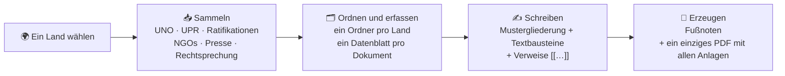

<p align="center"></p>

<h1 align="center">Probasile</h1>

<p align="center"><b>Kein Mensch ist illegal. Papiere für alle.</b><br>
<i>Beweise und Schreibhilfe für das belgische Ausländerrecht.</i></p>

<p align="center">


</p>

<p align="center">
<a href="#-installation">Installation</a> ·
<a href="#-was-macht-probasile">Funktionen</a> ·
<a href="#-erste-schritte">Erste Schritte</a> ·
<a href="#-häufige-fragen">FAQ</a> ·
<a href="#-mitmachen">Mitmachen</a> ·
<a href="README.md">🇧🇪 Français</a> ·
<a href="README_nl.md">🇧🇪 Nederlands</a>
</p>

> 🗣️ **Hinweis: Die Oberfläche, die Mustergliederungen und die juristischen Textbausteine sind derzeit auf Französisch.** Die Sammlung der Quellen (UNO, UPR, Ratifikationen, NGOs, Rechtsprechung) funktioniert für alle, auch für deutschsprachige Akten. Eine deutsche Fassung der Oberfläche und der Textbausteine wäre ein schönes Ziel: [Hilfe ist willkommen](#-mitmachen)!

---

## ✊ Warum Probasile

Bei einem Antrag auf internationalen Schutz, einer Beschwerde gegen eine Anweisung, das Staatsgebiet zu verlassen, oder einem Antrag nach Artikel 9ter **muss die betroffene Person selbst das Risiko belegen, dem sie ausgesetzt ist**. Dafür muss man:

- die abschließenden Bemerkungen der UN-Ausschüsse, NGO-Berichte, Ratifikationen und Rechtsprechung heraussuchen;
- Daten und Dokumentensignaturen überprüfen;
- saubere Fußnoten schreiben;
- Dutzende Anlagen nummerieren und zusammenstellen.

Das kostet Stunden, und diese Stunden fehlen, um den Menschen zuzuhören und ihre Akte aufzubauen.

**Probasile übernimmt diese sich wiederholende Arbeit.** Es sucht die Quellen, ordnet sie, zitiert sie korrekt und stellt das Anlagenkonvolut zusammen. So bleibt die Zeit für das, was zählt: die Geschichte der Person und die Argumentation.

Es ist **freie und kostenlose Software**, gemacht von und für die Praxis:

- Anwält\*innen und Jurist\*innen im Ausländerrecht;
- Rechtsberatungsstellen von Vereinen und Organisationen;
- Beratungssprechstunden, Law Clinics und Studierende.

> 🔒 **Alles bleibt auf deinem eigenen Computer.** Probasile hat keinen Server und kein Konto und sammelt keine Daten. Die Dokumente deiner Mandant\*innen verlassen nie deinen Rechner.

---

## 🧭 Auf einen Blick



---

## 📸 Bildschirmfotos

<p align="center"></p>
<p align="center"><i>Der erzeugte Text: Die Verweise sind zu Fußnoten geworden, mit « Ibid. », der freien Übersetzung und dem Hinweis auf die Anlage.</i></p>

<table>
<tr>
<td width="50%"><br><sub><b>Sammeln</b>: UN-Ausschüsse, Stand der Staatenberichte, UPR, Ratifikationen.</sub></td>
<td width="50%"><br><sub><b>Schreiben</b>: Mustergliederung, juristische Textbausteine und die Verweise des Landes.</sub></td>
</tr>
<tr>
<td><br><sub><b>Verweise</b>: jede Quelle zitierfertig; du wählst, was als Anlage beigefügt wird.</sub></td>
<td><br><sub><b>Berechnete Absätze</b>: Ratifikationen, Verzögerungen, Beschwerdeverfahren, geschrieben auf Grundlage der gesammelten Daten.</sub></td>
</tr>
<tr>
<td><br><sub><b>Rechtsprechung</b>: EGMR, EuGH, Verfassungsgerichtshof, Import per Referenz.</sub></td>
<td><br><sub><b>Anlagen</b>: ein einziges PDF, mit Deckblatt und Stempel « Annexe n° 1 – p. 1/15 ».</sub></td>
</tr>
</table>

<sub>Fiktives Beispiel (« Monsieur A. Exemple »); die UN-Dokumente sind öffentlich. Die Bildschirmfotos zeigen die französische Oberfläche.</sub>

---

## 🔧 Was macht Probasile?

### 1. Die Quellen zu einem Land sammeln

| Registerkarte | Was gesammelt wird |
|---|---|
| **UNO** | <ul><li>**Vertragsorgane** (CCPR, CAT, CESCR, CEDAW, CRC, CERD, CED, CRPD, CMW): abschließende Bemerkungen, Fragenlisten, Staatenberichte, Follow-up-Schreiben. Die Dokumente werden über ihre Signatur gefunden (z. B. `CCPR/C/IDN/CO/2`), auf Französisch, wenn es diese Fassung gibt, sonst auf Englisch.</li><li>**Stand der Staatenberichte**: Fälligkeits- und Eingangsdaten, nützlich, um die Verzögerungen des Staates zu belegen.</li><li>**Allgemeine Periodische Überprüfung (UPR)**: nationaler Bericht, UN-Zusammenstellung, Zusammenfassung der Stakeholder-Beiträge, Empfehlungen und welche davon der Staat angenommen oder nur « zur Kenntnis genommen » hat.</li><li>**Ratifikationen**: Daten der Unterzeichnung und Ratifikation, Text der Vorbehalte und Erklärungen, Einsprüche anderer Staaten, angenommene oder abgelehnte Individualbeschwerdeverfahren.</li></ul> |
| **Berichte (ReliefWeb)** | Berichte von OHCHR, UNHCR, WHO, UNICEF, Human Rights Watch, Amnesty International, Crisis Group, FIDH, OMCT, EUAA, dem US-Außenministerium… Filter nach Thema, Zeitraum, Sprache und Stichwörtern. Zwei Voreinstellungen: **Menschenrechte (internationaler Schutz, Ausreiseanweisung)** und **Gesundheit (9ter)**. |
| **Presse und Beobachtung** | RSS-Feeds und Google-News-Suchen, etwa auf Seiten nationaler Medien oder NGOs, in der Sprache des Landes. Die Listen werden pro Land gespeichert. |
| **Rechtsprechung** | <ul><li>**Automatische Suche**: EGMR (HUDOC), EuGH und Verfassungsgerichtshof, gefiltert nach Artikel (z. B. « 3 EMRK, 33 Genfer Konvention »).</li><li>**Import per Referenz**: Staatsrat, Rat für Ausländerstreitsachen, Kassationshof (ECLI) und UN-Ausschüsse (z. B. `CAT/C/66/D/832/2017`).</li><li>Jede Entscheidung erhält eine **fertig formatierte Zitierweise** (in französischer Schreibweise).</li></ul> |
| **Importieren** | Jedes selbst gefundene Dokument, als Datei oder Link. Mitteilungen der Sonderverfahren (`AL`, `UA`, `OL`) werden automatisch erkannt. |

Bei späteren Suchläufen holt die Option **« Nouveautés seulement »** (nur Neues) nur, was seit dem letzten Mal veröffentlicht wurde, und das **Protokoll** listet es auf.

### 2. Ordnen und erfassen

Jedes Dokument wird nach Kategorie im Ordner des Landes abgelegt:

```
Probasile/
└── Indonésie (IDN)/
    ├── 00_Pieces_du_dossier/          ← deine eigenen Unterlagen (immer als Anlage)
    ├── 01_ONU_organes_de_traites/
    ├── 02_Ratifications/
    ├── 03_ONU_EPU/
    ├── 04_ONU_procedures_speciales/
    ├── 05_ONU_HCDH/  …  10_Presse/
    ├── 11_Jurisprudence/  12_A_classer/
    ├── Redaction/                     ← deine Gliederungen, Fußnoten und Anlagen
    ├── sources.csv                    ← ein Datenblatt pro Dokument
    └── journal_….txt                  ← die Neuheiten jedes Suchlaufs
```

`sources.csv` öffnet sich in LibreOffice Calc oder Excel. Jedes Datenblatt enthält Autor, Titel, Signatur, Datum, Link und Abrufdatum. Die Spalten « annexe » und « remarques » gehören dir: Kein Suchlauf überschreibt sie.

### 3. Schreiben

- **Mustergliederungen** für **internationalen Schutz**, die **Nicht-Erteilung einer Ausreiseanweisung** und **9ter**, im Format **Word (.docx)** oder **LibreOffice (.odt)**, anpassbar: Abschnitte hinzufügen, umbenennen, verschieben oder löschen.
- **Automatische grammatische Anpassung** je nachdem, wer den Antrag stellt (ein Mann, eine Frau, mehrere Personen oder eine Familie, mehrere Frauen).
- **Absätze, die aus den gesammelten Daten berechnet werden**, mit ihren Fußnoten: nicht ratifizierte Verträge, abgelehnte Beschwerdeverfahren, verspätete Staatenberichte (die Verzögerung wird berechnet), nie übermittelte Follow-up-Informationen.
- **Eine Bibliothek juristischer Textbausteine**, jeweils mit Quellen belegt:
  - Flüchtlingsdefinition, begründete Furcht, frühere Verfolgung;
  - Akteure der Verfolgung und des Schutzes, Gruppenverfolgung;
  - subsidiärer Schutz, Non-Refoulement;
  - **fristgerechte Antragstellung**: Achttagesfrist, Art. 50; triftige Gründe für eine verspätete Antragstellung, belegt durch sozialwissenschaftliche Forschung;
  - Artikel 3 EMRK, Kindeswohl (Art. 74/13);
  - 9ter und die Rechtsprechung Paposhvili…

Die Bausteine berücksichtigen die seit der Reform von 2026 geltenden Regeln: **Gesetz vom 16. Juni 2026**, **Verordnungen (EU) 2024/1347 und 2024/1348**. Sie zitieren außerdem Rechtsprechung (EGMR, EuGH, Rat für Ausländerstreitsachen), das UNHCR-Handbuch und sozialwissenschaftliche Literatur. Jeder Baustein lässt sich in Word oder LibreOffice bearbeiten, und du kannst eigene hinzufügen.

### 4. Fußnoten und Anlagen erzeugen

Du schreibst in Word oder LibreOffice und setzt einen **Verweis** in doppelte eckige Klammern, wo eine Fußnote hin soll:

```
Le Comité s'est déclaré « profondément préoccupé par le nombre d'exécutions extrajudiciaires »[[CCPR/C/IDN/CO/2, §10, p.3]].
```

Probasile macht daraus eine vollständige Fußnote:
- beim ersten Mal mit der vollständigen Referenz, danach mit *op. cit.* oder *Ibid.* ;
- die Anlagen werden in der Reihenfolge des ersten Zitats nummeriert ;
- die Fußnote erhält den Hinweis « voir l'annexe n° X au présent courrier ».

| Du schreibst | Ergebnis |
|---|---|
| `[[CCPR/C/IDN/CO/2, §24, p.8]]` | Beim ersten Mal vollständige Fußnote, danach *op. cit.* oder *Ibid.* |
| `[[… +trad]]` | Fügt « Traduction libre de : » (freie Übersetzung) hinzu |
| `[[… +souligne]]` | Fügt « nous soulignons » (Hervorhebung durch uns) hinzu |
| `[[… +sansannexe]]` | Zitiert die Quelle, ohne sie als Anlage beizufügen |
| `[[A, §3 ; B, p.2]]` | Mehrere Quellen in einer Fußnote |
| `[[= freier Text]]` | Selbst geschriebene Fußnote |
| `[[PIECE Name]]` | Verweist auf eine Unterlage aus der Akte |
| `[[BLOC Name]]` | Fügt einen Baustein aus der Bibliothek in seiner neuesten Fassung ein |
| `[[LOI1980, art. 74/13]]` | Referenztext (Gesetze, Verträge, Verordnungen, Urteile) |

Probasile erstellt anschließend:

- 📝 eine Kopie des Textes **mit Fußnoten** (der Originaltext bleibt immer unverändert);
- 📎 die **nummerierten Anlagen**, mit Verzeichnis;
- 📕 **ein einziges PDF** mit allen Anlagen, jeweils mit einem Deckblatt davor; Word-Dateien und Fotos werden dabei umgewandelt;
- 📋 einen Bericht, der unbekannte Verweise und fehlende Dateien meldet.

### 5. Die Gesetzgebung prüfen

Die Schaltfläche **« Vérifier la législation… »** (Registerkarte Rédaction) beantwortet eine Frage: *Haben sich die Texte geändert, die meine Bausteine zitieren?* Probasile liest die aktuelle Fassung:

- des **Ausländergesetzes vom 15. Dezember 1980** und des **Königlichen Erlasses vom 8. Oktober 1981** (Justel);
- der **Verordnungen (EU) 2024/1347 und 2024/1348** und der **Richtlinie 2011/95/EU** (EUR-Lex);
- des **Königlichen Erlasses über die Liste der sicheren Herkunftsstaaten**.

Es meldet, welche Artikel geändert oder aufgehoben wurden, seit wann, und **welche Bausteine du gegenlesen solltest**. Der ausführliche Bericht zeigt den Text vor und nach der Änderung, mit den amtlichen Links. Das **[Bulletin](BULLETIN.md)**, von Jurist\*innen geschrieben, erklärt, was sich konkret ändert.

---

## 💾 Installation

**Voraussetzungen, einmalig zu installieren:**

- **Windows**: nichts. Das Installationsprogramm findet Python oder installiert es selbst (für dein Konto, ohne Administratorrechte).
- **macOS / Linux**: [Python 3](https://www.python.org/downloads/) (oft schon vorhanden).
- Ein Textverarbeitungsprogramm: **Microsoft Word** oder **[LibreOffice](https://de.libreoffice.org/)** (kostenlos).

**Danach:**

1. Lade die ZIP-Datei der neuesten Version unter **[Releases](../../releases/latest)** herunter und entpacke sie, wo du möchtest (zum Beispiel in *Dokumente*).
2. **Doppelklicke** auf die Installationsdatei für dein System. Du musst keinen einzigen Befehl eingeben.

| System | Doppelklick auf | Falls sie sich nicht öffnet |
|---|---|---|
| 🪟 Windows | `installer_windows.bat` | Bei einer Warnung von Windows: *Weitere Informationen* → *Trotzdem ausführen* |
| 🐧 Linux | `Installer Probasile (Linux).sh` | Rechtsklick → *Als Programm ausführen* (oder *Starten*). Sonst (häufig): die Terminal-Methode unten |
| 🍎 macOS | `Installer Probasile (Mac).command` | Rechtsklick → *Öffnen* → *Öffnen* (nicht verifizierter Entwickler) |

**Klappt der Doppelklick nicht** (häufig unter Linux, weil die heruntergeladene Zip-Datei das Recht verliert, Skripte auszuführen): öffne ein Terminal im Programmordner (Rechtsklick → *Im Terminal öffnen*) und tippe `sh installer_mac_linux.sh`. Das funktioniert auch unter macOS (App Terminal).

Ein Fenster zeigt die Installation und bietet anschließend an, Probasile zu starten. Fehlen unter Linux Python-Komponenten (`python3-venv`, `python3-tk`), bietet das Installationsprogramm an, sie hinzuzufügen; dein Passwort wird dann abgefragt.

**Danach startest du Probasile wie jedes andere Programm, mit eigenem Icon:**

- **Windows**: Startmenü und Desktop. Für die Taskleiste: Rechtsklick auf Probasile im Startmenü → *An Taskleiste anheften*.
- **Linux**: Anwendungsmenü (Kategorie *Büro*) und Desktop.
- **macOS**: Ordner *Programme* deines Benutzerkontos; zieh Probasile ins Dock.

Unter macOS und Linux wird außerhalb des Programmordners nichts installiert, und die Python-Installation des Systems bleibt unverändert. Unter Windows werden Python (falls es fehlte) und die Module nur für dein Konto installiert.

<details>
<summary><b>Deinstallieren</b></summary>

1. Entferne die Verknüpfungen: Doppelklick auf `desinstaller_windows.bat` (Windows) oder `./installer_mac_linux.sh --retirer` ausführen (macOS / Linux).
2. Lösche den Programmordner.
3. Lösche bei Bedarf auch deinen Basisordner (deine Dokumente) und die Einstellungsdatei `.collecte_pays.json` in deinem persönlichen Ordner.

</details>

---

## 🚀 Erste Schritte

1. **Wähle das Land**: Die ersten Buchstaben filtern die Liste. Prüfe die im Satz verwendete Form (« de l'Indonésie », « du Maroc »).
2. **Wähle den Basisordner**, einmalig; er wird gespeichert.
3. **Kreuze an, was du sammeln möchtest**, und klicke auf **« Lancer la collecte »** (Suche starten). Beim ersten Suchlauf « Nouveautés seulement » abwählen.
4. Gib in der Registerkarte **Rédaction** (Schreiben) den Namen ein und wer den Antrag stellt, wähle das Verfahren und **erstelle die Gliederung**. Wähle die Bausteine und kreuze « Paragraphes calculés » (berechnete Absätze hinzufügen) an.
5. **Schreibe in Word oder LibreOffice** und füge deine Verweise ein. Die Liste der Verweise des Landes (Doppelklick kopiert den Verweis) und die Schaltfläche « Comment écrire une note ? » helfen dir dabei.
6. Klicke auf **« Générer »** (erzeugen): Du erhältst den Text mit Fußnoten und das PDF der Anlagen im Ordner `Redaction` des Landes.

Jede Registerkarte hat eine Schaltfläche **« Mode d'emploi »** (Anleitung), und beim Überfahren einer Schaltfläche erscheint ein Hinweis. Die vollständige Anleitung (auf Französisch) steht in [`LISEZMOI.txt`](LISEZMOI.txt). Um Probasile anderen vorzustellen: das **[Demo-Kit](kit_de_demo/)** (fiktives Dossier, Demo-Leitfaden für 5 oder 25 Minuten, Präsentationen zum Programm und zur Installation, erwartete Ergebnisse; auf Französisch).

---

## 🔐 Deine Daten

- **Alles bleibt lokal.** Dokumente, Datenblätter, Gliederungen, Fußnoten und Unterlagen bleiben in dem Basisordner, den du wählst. Probasile verbindet sich nur mit den öffentlichen Websites, von denen es die Quellen holt (UNO, ReliefWeb, Gerichte, die von dir gewählten Feeds).
- **Deine eigenen Änderungen bleiben erhalten.** Die Bausteinbibliothek, die juristischen Referenzen und die Mustergliederungen liegen in deinem Basisordner. Eine neue Version von Probasile aktualisiert nur, was du nicht selbst geändert hast, und behält eine Kopie der alten Bibliothek.
- **Deine eigenen Spalten bleiben erhalten.** Die Spalten « annexe » und « remarques » in `sources.csv` werden nie überschrieben.
- **Vorsicht bei Fehlermeldungen.** Prüfe, bevor du ein Protokoll oder eine Datei einer öffentlichen Meldung beifügst, dass darin keine Namen oder personenbezogenen Daten stehen.

---

## 🌐 Respekt gegenüber den abgerufenen Websites

Probasile ist kein Suchroboter: **Du startest es**, für eine begrenzte Zahl von Dokumenten. Es pausiert zwischen den Anfragen und gibt sich klar zu erkennen. Die UN-Websites bitten darum, nicht von automatisierten Programmen durchsucht zu werden. Wer das strikt respektieren möchte, kreuzt **« Liens seulement »** (nur Links) an: Probasile erstellt dann eine Seite mit allen Links, und du klickst selbst.

Für ReliefWeb verlangt die offizielle Schnittstelle (API) einen kostenlosen **Anwendungsnamen** (appname), den man mit einer beruflichen E-Mail-Adresse beantragt. Ohne appname nutzt Probasile automatisch **RSS-Feeds**, ohne Registrierung.

---

## ❓ Häufige Fragen

<details>
<summary><b>Muss ich programmieren können?</b></summary>

Nein. Alles funktioniert über Schaltflächen und Kästchen, und du schreibst wie gewohnt in Word oder LibreOffice. Die Befehlszeile ist eine Option für alle, die das möchten.
</details>

<details>
<summary><b>Kann ich Probasile für deutschsprachige Akten verwenden?</b></summary>

Ja, für die Sammlung der Quellen: UN-Dokumente, UPR, Ratifikationen, NGO-Berichte und Rechtsprechung sind dieselben. Die Fußnoten, die berechneten Absätze und die juristischen Bausteine werden derzeit **auf Französisch** erstellt. Du kannst die Bausteine und Gliederungen in LibreOffice selbst auf Deutsch umschreiben. Eine deutsche Fassung wäre ein schönes Projekt, und Hilfe dabei ist sehr willkommen.
</details>

<details>
<summary><b>Funktioniert es mit Word?</b></summary>

Ja. Die Gliederung kann als **Word-Datei (.docx)** erstellt werden, und ein in Word geschriebener Text erhält echte Word-Fußnoten. LibreOffice (.odt) bleibt möglich. Anlagen im Word-Format werden automatisch in PDF umgewandelt (mit LibreOffice oder, unter Windows, mit Word).
</details>

<details>
<summary><b>Sind die juristischen Bausteine aktuell?</b></summary>

Sie berücksichtigen die Reform von 2026 (Gesetz vom 16. Juni 2026, Verordnungen (EU) 2024/1347 und 2024/1348), und die Zitate wurden an den Texten selbst überprüft. Das Recht ändert sich jedoch schnell: **Lies die Bausteine immer gegen** und passe sie an die Akte an.
</details>

<details>
<summary><b>Für welche Länder funktioniert es?</b></summary>

Für alle UN-Mitgliedstaaten. Nationale Quellen (Presse, lokale NGOs) fügst du pro Land in der Beobachtung und im Quellenkatalog hinzu.
</details>

<details>
<summary><b>Ein Suchlauf findet nichts, obwohl das Dokument existiert.</b></summary>

Websites ändern manchmal ihr Layout. Importiere das Dokument selbst (Registerkarte « Importer ») und melde das Problem mit dem Protokoll: So wird Probasile besser.
</details>

---

## 🚧 Projektstand und bekannte Einschränkungen

Probasile ist in **Version 1.0**: Es wird in der Praxis eingesetzt, ist aber noch jung.

- Die Oberfläche, die Mustergliederungen und die juristischen Bausteine sind derzeit **nur auf Französisch**.
- Die Datenbank der UN-Vertragsorgane ist eine komplexe Webanwendung. Antwortet sie nicht, meldet das Protokoll dies und gibt den Link an, um die Seite selbst aufzurufen.
- Mitteilungen der Sonderverfahren werden nicht automatisch gesucht: Du suchst sie selbst und importierst sie (danach werden sie automatisch erkannt).
- Der Kassationshof ist nur über ECLI erreichbar. Beim Internationalen Gerichtshof musst du das PDF selbst importieren.
- Aus PDFs gelesene Daten solltest du überprüfen.
- Die Installationsprogramme für Windows und macOS sind weniger getestet als das für Linux: Deine Rückmeldungen sind wertvoll.

---

## 🤝 Mitmachen

Alle Beiträge sind willkommen, **auch ohne Programmierkenntnisse**:

- 🇩🇪 **Bei einer deutschen Fassung helfen**: Oberfläche, Mustergliederungen, juristische Bausteine.
- 🐛 **Ein Problem melden**: Eröffne ein [Issue](../../issues). Beschreibe, was du gerade gemacht hast, und füge das Protokoll bei, ohne personenbezogene Daten.
- ⚖️ **Einen juristischen Baustein vorschlagen oder verbessern**, ein aktuelles Urteil oder eine Referenz: Ein Issue mit dem Text und den Quellen genügt.
- 🗺️ **Verlässliche nationale Quellen teilen** für ein Land (NGOs, Presse, RSS-Feeds).
- 🧪 **Unter Windows oder macOS testen** und berichten, wie es lief.
- 💻 **Code**: *Pull Requests* sind willkommen. Das Programm ist in Python mit einer tkinter-Oberfläche geschrieben. Der Kern steckt in `collecte.py` (Sammeln), `redaction.py` (Fußnoten und Anlagen), `bibliotheque.py` (Bausteine), `conditionnels.py` (berechnete Absätze) und `jurisprudence.py`.

---

## ⚖️ Lizenz und Haftungsausschluss

Probasile ist **freie Software**, verbreitet unter der [**GNU General Public License v3.0 oder später**](LICENSE). Du darfst es nutzen, untersuchen, verändern und weitergeben, auch in veränderter Form. Jede weitergegebene Fassung muss frei bleiben, unter derselben Lizenz und mit dem Quellcode.

Die Textbausteine und juristischen Referenzen sind ein **Ausgangspunkt**. Sie müssen für jede Akte gegengelesen, überprüft und angepasst werden und **stellen keine Rechtsberatung dar**. Die Software wird ohne jede Gewährleistung bereitgestellt.

<p align="center"><br>🕊️<br><i>Grenzen töten. Beweise schützen.</i></p>
