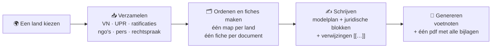
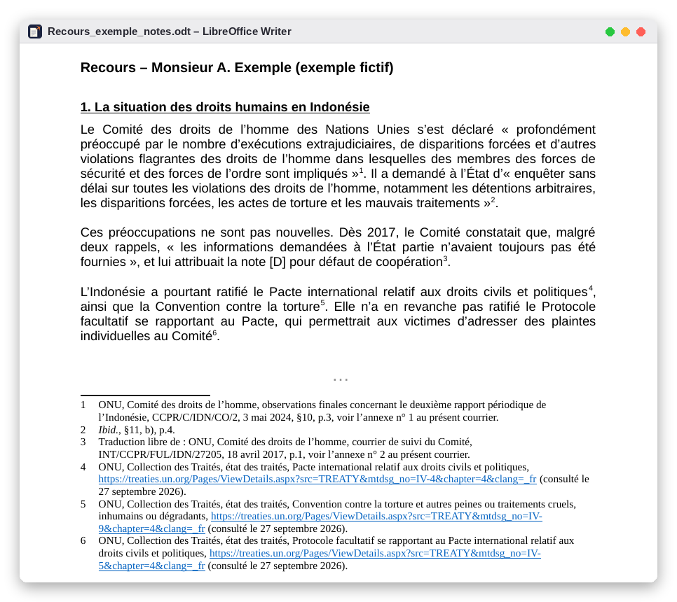
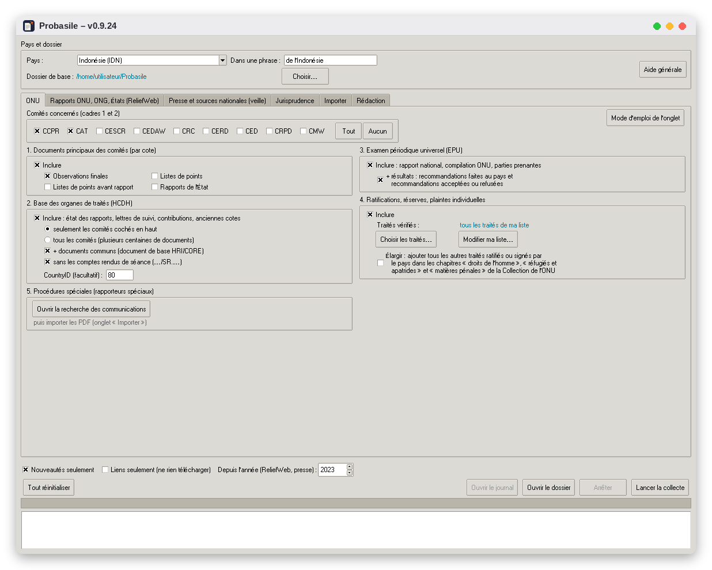
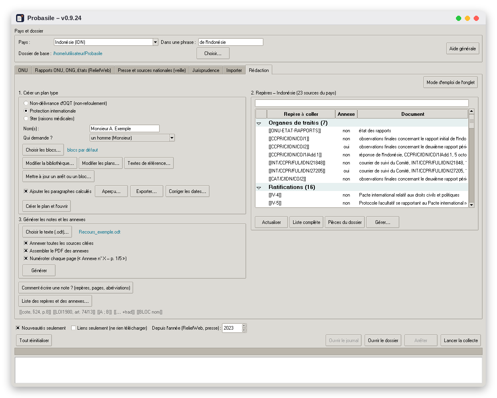
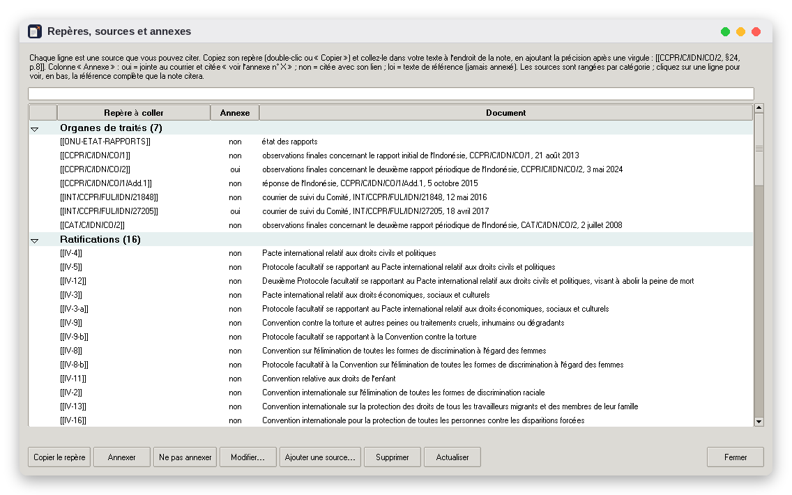
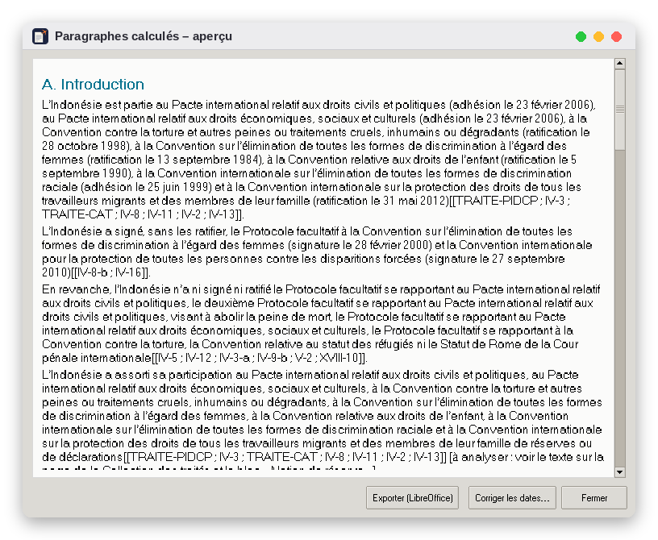
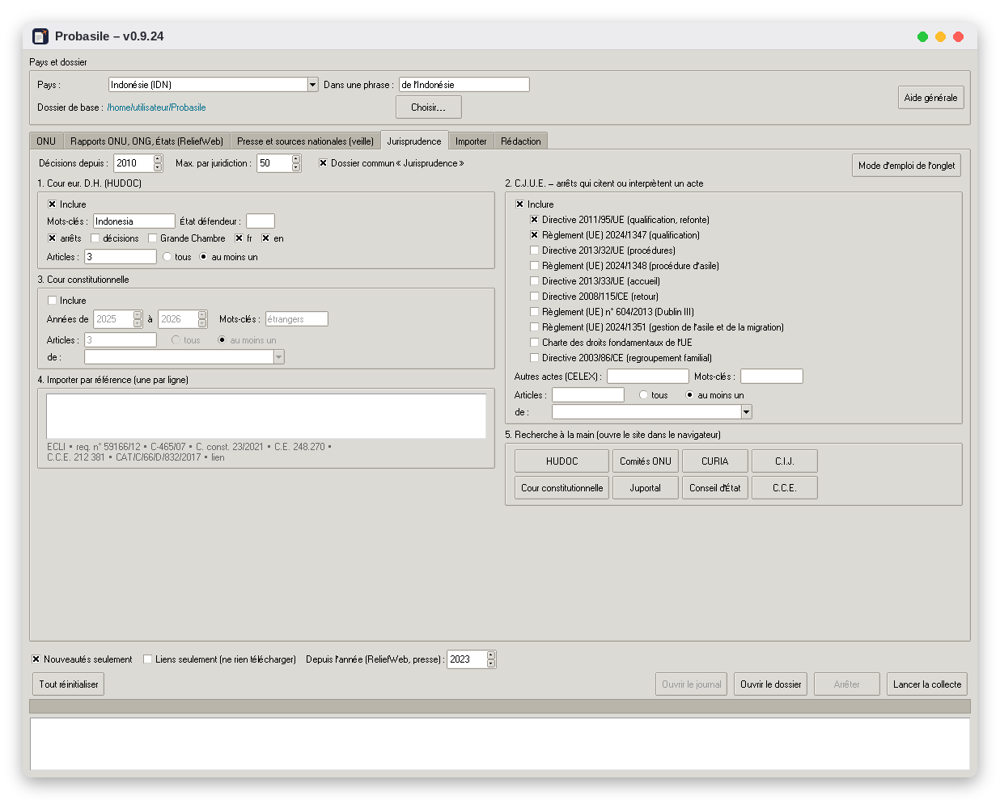
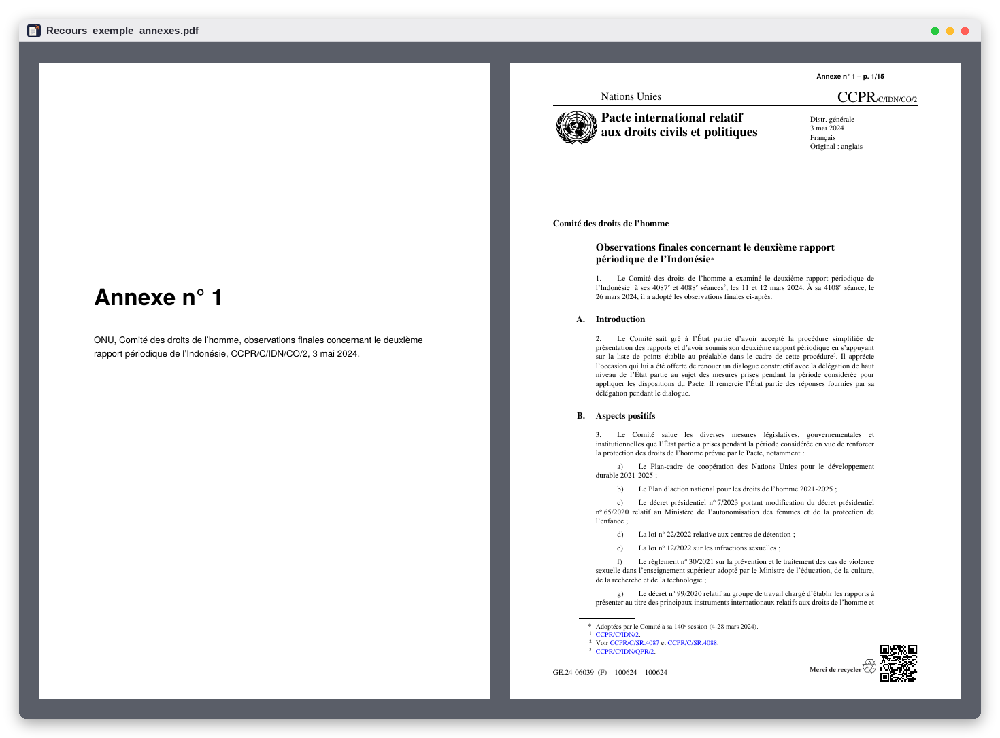

<p align="center"></p>

<h1 align="center">Probasile</h1>

<p align="center"><b>Geen mens is illegaal. Papieren voor iedereen.</b><br>
<i>Bewijs en schrijfhulp voor het Belgische vreemdelingenrecht.</i></p>

<p align="center">


</p>

<p align="center">
<a href="#-installatie">Installatie</a> ·
<a href="#-wat-doet-probasile">Functies</a> ·
<a href="#-aan-de-slag">Aan de slag</a> ·
<a href="#-veelgestelde-vragen">FAQ</a> ·
<a href="#-bijdragen">Bijdragen</a> ·
<a href="README.md">🇧🇪 Français</a> ·
<a href="README_de.md">🇧🇪 Deutsch</a>
</p>

> 🗣️ **Let op: de interface, de modelplannen en de juridische tekstblokken zijn voorlopig in het Frans.** De verzameling van bronnen (VN, UPR, ratificaties, ngo's, rechtspraak) werkt voor iedereen, ook voor Nederlandstalige dossiers. Een Nederlandstalige versie van de interface en van de tekstblokken is een van de volgende doelen: [hulp is welkom](#-bijdragen)!

---

## ✊ Waarom Probasile

Bij een verzoek om internationale bescherming, een beroep tegen een bevel om het grondgebied te verlaten of een aanvraag 9ter **moet de betrokkene zelf het risico aantonen dat hij of zij loopt**. Daarvoor moet je:

- de slotopmerkingen van de VN-comités, ngo-rapporten, ratificaties en rechtspraak opzoeken;
- data en documentsymbolen controleren;
- nette voetnoten schrijven;
- tientallen bijlagen nummeren en bundelen.

Dat kost uren, en die uren gaan af van de tijd om naar mensen te luisteren en hun dossier op te bouwen.

**Probasile neemt dat repetitieve werk over.** Het zoekt de bronnen op, ordent ze, citeert ze correct en stelt de bundel bijlagen samen. Zo blijft de tijd over voor wat telt: het verhaal van de persoon en de argumentatie.

Het is **vrije en gratis software**, gemaakt door en voor het werkveld:

- advocaten en juristen vreemdelingenrecht;
- juridische diensten van organisaties;
- zitdagen, rechtsklinieken en studenten.

> 🔒 **Alles blijft op je eigen computer.** Probasile heeft geen server en geen account, en verzamelt geen gegevens. De documenten van je cliënten verlaten je computer nooit.

---

## 🧭 In één oogopslag



---

## 📸 Schermafbeeldingen

<p align="center"></p>
<p align="center"><i>De gegenereerde tekst: de verwijzingen zijn voetnoten geworden, met « Ibid. », de vrije vertaling en de verwijzing naar de bijlage.</i></p>

<table>
<tr>
<td width="50%"><br><sub><b>Verzamelen</b>: VN-comités, stand van de rapporten, UPR, ratificaties.</sub></td>
<td width="50%"><br><sub><b>Schrijven</b>: modelplan, juridische blokken en de verwijzingen van het land.</sub></td>
</tr>
<tr>
<td><br><sub><b>Verwijzingen</b>: elke bron klaar om te citeren; jij kiest wat als bijlage gaat.</sub></td>
<td><br><sub><b>Berekende paragrafen</b>: ratificaties, vertragingen, klachtprocedures, geschreven op basis van de verzamelde gegevens.</sub></td>
</tr>
<tr>
<td><br><sub><b>Rechtspraak</b>: EHRM, HvJ EU, Grondwettelijk Hof, import via referentie.</sub></td>
<td><br><sub><b>Bijlagen</b>: één pdf, met titelblad en stempel « Annexe n° 1 – p. 1/15 ».</sub></td>
</tr>
</table>

<sub>Fictief voorbeeld (« Monsieur A. Exemple »); de VN-documenten zijn openbaar. De schermafbeeldingen tonen de Franstalige interface.</sub>

---

## 🔧 Wat doet Probasile?

### 1. De bronnen over een land verzamelen

| Tabblad | Wat wordt verzameld |
|---|---|
| **VN** | <ul><li>**Verdragsorganen** (CCPR, CAT, CESCR, CEDAW, CRC, CERD, CED, CRPD, CMW): slotopmerkingen, lijsten van vragen, staatsrapporten, opvolgingsbrieven. De documenten worden opgehaald via hun symbool (bv. `CCPR/C/IDN/CO/2`), in het Frans als die versie bestaat, anders in het Engels.</li><li>**Stand van de rapporten**: vervaldata en indieningsdata, handig om de vertragingen van de staat aan te tonen.</li><li>**Universeel Periodiek Onderzoek (UPR)**: nationaal rapport, VN-compilatie, samenvatting van de belanghebbenden, aanbevelingen, en welke de staat heeft aanvaard of enkel « genoteerd ».</li><li>**Ratificaties**: data van ondertekening en ratificatie, tekst van voorbehouden en verklaringen, bezwaren van andere staten, al dan niet aanvaarde individuele klachtprocedures.</li></ul> |
| **Rapporten (ReliefWeb)** | Rapporten van OHCHR, UNHCR, WHO, UNICEF, Human Rights Watch, Amnesty International, Crisis Group, FIDH, OMCT, EUAA, het Amerikaanse State Department… Filteren kan op thema, periode, taal en trefwoorden. Er zijn twee voorinstellingen: **Mensenrechten (IB, BGV)** en **Gezondheid (9ter)**. |
| **Pers en opvolging** | RSS-feeds en zoekopdrachten in Google Nieuws, bijvoorbeeld op sites van nationale media of ngo's, in de taal van het land. De lijsten worden per land bewaard. |
| **Rechtspraak** | <ul><li>**Automatisch zoeken**: EHRM (HUDOC), HvJ EU en Grondwettelijk Hof, gefilterd op artikel (bv. « 3 EVRM, 33 Genève »).</li><li>**Import via referentie**: RvS, RvV, Hof van Cassatie (ECLI) en VN-comités (bv. `CAT/C/66/D/832/2017`).</li><li>Elke beslissing krijgt een **kant-en-klare citeerwijze** (in Franstalige notatie).</li></ul> |
| **Importeren** | Elk document dat je zelf vindt, als bestand of als link. Mededelingen van de speciale procedures (`AL`, `UA`, `OL`) worden automatisch herkend. |

Bij latere zoekrondes haalt de optie **« Nouveautés seulement »** (enkel nieuwe documenten) alleen op wat sinds de vorige keer is verschenen, en het **logboek** geeft er een overzicht van.

### 2. Ordenen en fiches maken

Elk document wordt per categorie opgeslagen in de map van het land:

```
Probasile/
└── Indonésie (IDN)/
    ├── 00_Pieces_du_dossier/          ← je eigen stukken (altijd als bijlage)
    ├── 01_ONU_organes_de_traites/
    ├── 02_Ratifications/
    ├── 03_ONU_EPU/
    ├── 04_ONU_procedures_speciales/
    ├── 05_ONU_HCDH/  …  10_Presse/
    ├── 11_Jurisprudence/  12_A_classer/
    ├── Redaction/                     ← je plannen, voetnoten en bijlagen
    ├── sources.csv                    ← één fiche per document
    └── journal_….txt                  ← de nieuwe documenten van elke zoekronde
```

`sources.csv` opent in LibreOffice Calc of Excel. Elke fiche vermeldt de auteur, de titel, het symbool, de datum, de link en de raadplegingsdatum. De kolommen « annexe » en « remarques » zijn van jou: geen enkele zoekronde overschrijft ze.

### 3. Schrijven

- **Modelplannen** voor **internationale bescherming**, **niet-afgifte van een BGV** en **9ter**, aanpasbaar in LibreOffice: secties toevoegen, hernoemen, verplaatsen of schrappen.
- **Automatische grammaticale overeenstemming** volgens wie de aanvraag indient (een man, een vrouw, meerdere personen of een gezin, meerdere vrouwen).
- **Paragrafen berekend op basis van de verzamelde gegevens**, met hun voetnoten: niet-geratificeerde verdragen, geweigerde klachtprocedures, laattijdige rapporten (de vertraging wordt berekend), nooit bezorgde opvolgingsinformatie.
- **Een bibliotheek van juridische tekstblokken**, elk gestaafd met bronnen: definitie van vluchteling, gegronde vrees, eerdere vervolging, actoren van vervolging en bescherming, groepsvervolging, subsidiaire bescherming, non-refoulement, **tijdig indienen van het verzoek** (termijn van acht dagen, art. 50; geldige redenen voor een laattijdig verzoek, gestaafd met sociaalwetenschappelijk onderzoek), artikel 3 EVRM, belang van het kind (art. 74/13), 9ter en de rechtspraak Paposhvili…

De blokken zijn afgestemd op de regels die gelden sinds de hervorming van 2026: **wet van 16 juni 2026**, **verordeningen (EU) 2024/1347 en 2024/1348**. Ze citeren ook rechtspraak (EHRM, HvJ EU, RvV), het UNHCR-handboek en sociaalwetenschappelijke literatuur. Elk blok is in LibreOffice aan te passen, en je kunt er zelf blokken bij maken.

### 4. Voetnoten en bijlagen genereren

Je schrijft in LibreOffice en zet een **verwijzing** tussen dubbele vierkante haken waar een voetnoot moet komen:

```
Het Comité is « profondément préoccupé par le nombre d’exécutions extrajudiciaires »[[CCPR/C/IDN/CO/2, §10, p.3]].
```

Probasile maakt er dan een volledige voetnoot van, de eerste keer met de volledige referentie en daarna met *op. cit.* of *Ibid.*. Het nummert de bijlagen in de volgorde waarin ze voor het eerst geciteerd worden en vermeldt « voir l'annexe n° X au présent courrier ».

| Je schrijft | Resultaat |
|---|---|
| `[[CCPR/C/IDN/CO/2, §24, p.8]]` | Volledige voetnoot de eerste keer, daarna *op. cit.* of *Ibid.* |
| `[[… +trad]]` | Voegt « Traduction libre de : » (vrije vertaling) toe |
| `[[… +souligne]]` | Voegt « nous soulignons » (wij onderlijnen) toe |
| `[[… +sansannexe]]` | Citeert de bron zonder ze als bijlage toe te voegen |
| `[[A, §3 ; B, p.2]]` | Meerdere bronnen in één voetnoot |
| `[[= vrije tekst]]` | Zelf geschreven voetnoot |
| `[[PIECE naam]]` | Verwijst naar een stuk uit het dossier |
| `[[BLOC naam]]` | Voegt een blok uit de bibliotheek in, in de meest recente versie |
| `[[LOI1980, art. 74/13]]` | Referentietekst (wetten, verdragen, verordeningen, arresten) |

Probasile maakt vervolgens:

- 📝 een kopie van de tekst **met voetnoten** (de oorspronkelijke tekst blijft altijd ongewijzigd);
- 📎 de **genummerde bijlagen**, met een inventaris;
- 📕 **één pdf** met alle bijlagen, elk voorafgegaan door een titelblad; Word-bestanden worden onderweg omgezet;
- 📋 een verslag dat onbekende verwijzingen en ontbrekende bestanden meldt.

---

## 💾 Installatie

**Vooraf, één keer te installeren:**

- [Python 3](https://www.python.org/downloads/): vink onder Windows **« Add Python to PATH »** aan tijdens de installatie;
- [LibreOffice](https://nl.libreoffice.org/): om de plannen te openen en Word-bijlagen om te zetten naar pdf.

**Daarna:**

1. Download het zip-bestand van de nieuwste versie bij **[Releases](../../releases/latest)** en pak het uit waar je wilt (bijvoorbeeld in *Documenten*).
2. **Dubbelklik** op het installatiebestand voor je systeem. Je hoeft geen enkele opdracht te typen.

| Systeem | Dubbelklik op | Als het niet opent |
|---|---|---|
| 🪟 Windows | `installer_windows.bat` | Bij een waarschuwing van Windows: *Meer informatie* → *Toch uitvoeren* |
| 🐧 Linux | `Installer Probasile (Linux).sh` | Rechtsklik → *Uitvoeren als programma* (of *Starten*) |
| 🍎 macOS | `Installer Probasile (Mac).command` | Rechtsklik → *Open* → *Open* (onbekende ontwikkelaar) |

Een venster toont de installatie en stelt daarna voor om Probasile te starten. Als onder Linux Python-onderdelen ontbreken (`python3-venv`, `python3-tk`), stelt het installatieprogramma voor om ze toe te voegen; je wachtwoord wordt dan gevraagd.

**Daarna start je Probasile zoals elke andere toepassing, met een eigen icoon:**

- **Windows**: startmenu en bureaublad. Voor de taakbalk: rechtsklik op Probasile in het startmenu → *Aan taakbalk vastmaken*.
- **Linux**: toepassingenmenu (categorie *Kantoor*) en bureaublad.
- **macOS**: map *Apps* van je account; sleep Probasile naar het Dock.

Er wordt niets buiten de programmamap geïnstalleerd, en de Python-installatie van je systeem blijft ongewijzigd.

<details>
<summary><b>Verwijderen</b></summary>

1. Verwijder de snelkoppelingen: dubbelklik op `desinstaller_windows.bat` (Windows), of voer `./installer_mac_linux.sh --retirer` uit (macOS / Linux).
2. Verwijder de programmamap.
3. Verwijder desgewenst ook je basismap (je documenten) en het instellingenbestand `.collecte_pays.json` in je persoonlijke map.

</details>

---

## 🚀 Aan de slag

1. **Kies het land**: typ de eerste letters om de lijst te filteren. Controleer de vorm die in een zin gebruikt wordt (« de l'Indonésie », « du Maroc »).
2. **Kies de basismap**, één keer; die wordt onthouden.
3. **Vink aan wat je wilt verzamelen** in de tabbladen en klik op **« Lancer la collecte »** (zoeken starten). Vink bij een eerste zoekronde « Nouveautés seulement » uit.
4. Vul in het tabblad **Rédaction** (schrijven) de naam in en wie de aanvraag indient, kies de procedure en **maak het plan aan**. Kies de blokken en vink « Ajouter les paragraphes calculés » (berekende paragrafen toevoegen) aan.
5. **Schrijf in LibreOffice** en voeg je verwijzingen toe. De lijst met verwijzingen van het land (dubbelklik kopieert de verwijzing) en de knop « Comment écrire une note ? » helpen je op weg.
6. Klik op **« Générer »** (genereren): je krijgt de tekst met voetnoten en de pdf met bijlagen, in de map `Redaction` van het land.

Elk tabblad heeft een knop **« Mode d'emploi »** (handleiding), en bij het aanwijzen van een knop verschijnt een tip. De volledige handleiding (in het Frans) staat in [`LISEZMOI.txt`](LISEZMOI.txt).

---

## 🔐 Je gegevens

- **Alles blijft lokaal.** Documenten, fiches, plannen, voetnoten en stukken blijven in de basismap die je kiest. Probasile maakt enkel verbinding met de openbare websites waar het de bronnen ophaalt (VN, ReliefWeb, rechtscolleges, de feeds die je zelf kiest).
- **Je eigen aanpassingen blijven behouden.** De blokkenbibliotheek, de juridische referenties en de modelplannen staan in je basismap. Een nieuwe versie van Probasile werkt enkel bij wat je niet zelf hebt aangepast, en bewaart een kopie van de oude bibliotheek.
- **Je eigen kolommen blijven behouden.** De kolommen « annexe » en « remarques » van `sources.csv` worden nooit overschreven.
- **Let op bij het melden van problemen.** Controleer voor je een logboek of bestand bij een openbare melding voegt dat er geen namen of persoonsgegevens in staan.

---

## 🌐 Respect voor de geraadpleegde websites

Probasile is geen zoekrobot: **jij start het**, voor een beperkt aantal documenten. Het pauzeert tussen de verzoeken en maakt zich duidelijk bekend. De VN-websites vragen om niet door geautomatiseerde programma's te worden doorzocht. Wil je dat strikt respecteren, vink dan **« Liens seulement »** (enkel links) aan: Probasile maakt dan een pagina met alle links, en jij klikt zelf.

Voor ReliefWeb vraagt de officiële API een gratis **toepassingsnaam** (appname), die je aanvraagt met een professioneel e-mailadres. Zonder appname gebruikt Probasile automatisch **RSS-feeds**, zonder registratie.

---

## ❓ Veelgestelde vragen

<details>
<summary><b>Moet ik kunnen programmeren?</b></summary>

Nee. Alles werkt met knoppen en vinkjes, en je schrijft zoals gewoonlijk in LibreOffice. De opdrachtregel is een optie voor wie dat wil.
</details>

<details>
<summary><b>Kan ik Probasile gebruiken voor Nederlandstalige dossiers?</b></summary>

Ja, voor het verzamelen van bronnen: VN-documenten, UPR, ratificaties, ngo-rapporten en rechtspraak zijn dezelfde. De voetnoten, de berekende paragrafen en de juridische blokken worden voorlopig **in het Frans** opgesteld. Je kan de blokken en plannen zelf in het Nederlands herschrijven in LibreOffice. Een volledige Nederlandstalige versie staat op de planning, en hulp daarbij is zeer welkom.
</details>

<details>
<summary><b>Werkt het met Word?</b></summary>

Je schrijft in **LibreOffice Writer** (gratis), en het gegenereerde document (`.odt`) opent daarna ook in Word. Bijlagen in Word-formaat worden automatisch naar pdf omgezet.
</details>

<details>
<summary><b>Zijn de juridische blokken up-to-date?</b></summary>

Ze houden rekening met de hervorming van 2026 (wet van 16 juni 2026, verordeningen (EU) 2024/1347 en 2024/1348), en de citaten zijn nagekeken in de teksten zelf. Het recht verandert echter snel: **lees de blokken altijd na** en pas ze aan het dossier aan.
</details>

<details>
<summary><b>Voor welke landen werkt het?</b></summary>

Voor alle VN-lidstaten. Nationale bronnen (pers, lokale ngo's) voeg je per land toe in de opvolging en in de catalogus van bronnen.
</details>

<details>
<summary><b>Een zoekronde vindt niets, terwijl het document wel bestaat.</b></summary>

Websites veranderen soms van opmaak. Importeer het document zelf (tabblad « Importer ») en meld het probleem met het logboek erbij: zo wordt Probasile beter.
</details>

---

## 🚧 Stand van het project en bekende beperkingen

Probasile is in **versie 0.9**: het wordt in de praktijk gebruikt, maar is nog jong.

- De interface, de modelplannen en de juridische blokken zijn voorlopig **enkel in het Frans**.
- De databank van de VN-verdragsorganen is een complexe webtoepassing. Als ze niet antwoordt, meldt het logboek dat en geeft het de link om de pagina zelf te raadplegen.
- Mededelingen van de speciale procedures worden niet automatisch opgezocht: je zoekt ze zelf en importeert ze (daarna worden ze wel automatisch herkend).
- Het Hof van Cassatie is enkel bereikbaar via ECLI. Voor het Internationaal Gerechtshof moet je de pdf zelf importeren.
- Data die uit pdf's worden gelezen, moet je nakijken.
- De installatieprogramma's voor Windows en macOS zijn minder getest dan dat voor Linux: je feedback is waardevol.

---

## 🤝 Bijdragen

Alle bijdragen zijn welkom, **ook als je niet kunt programmeren**:

- 🇳🇱 **Meehelpen aan de Nederlandstalige versie**: interface, modelplannen, juridische blokken (met de rechtspraak van de RvV en de Nederlandstalige rechtsleer).
- 🐛 **Een probleem melden**: open een [Issue](../../issues). Beschrijf wat je aan het doen was en voeg het logboek toe, zonder persoonsgegevens.
- ⚖️ **Een juridisch blok voorstellen of verbeteren**, of een recent arrest of een referentie: een Issue met de tekst en de bronnen volstaat.
- 🗺️ **Betrouwbare nationale bronnen delen** voor een land (ngo's, pers, RSS-feeds).
- 🧪 **Testen onder Windows of macOS** en laten weten hoe het ging.
- 💻 **Code**: *pull requests* zijn welkom. Het programma is geschreven in Python met een tkinter-interface. De kern zit in `collecte.py` (verzamelen), `redaction.py` (voetnoten en bijlagen), `bibliotheque.py` (blokken), `conditionnels.py` (berekende paragrafen) en `jurisprudence.py`.

---

## ⚖️ Licentie en disclaimer

Probasile is **vrije software**, verspreid onder de [**GNU General Public License v3.0 of later**](LICENSE). Je mag het gebruiken, bestuderen, aanpassen en verder verspreiden, ook in een aangepaste versie. Elke verspreide versie moet vrij blijven, onder dezelfde licentie en met de broncode.

De tekstblokken en juridische referenties zijn een **vertrekpunt**. Ze moeten voor elk dossier nagelezen, gecontroleerd en aangepast worden, en **vormen geen juridisch advies**. De software wordt geleverd zonder enige garantie.

<p align="center"><br>🕊️<br><i>Grenzen doden. Bewijs beschermt.</i></p>
